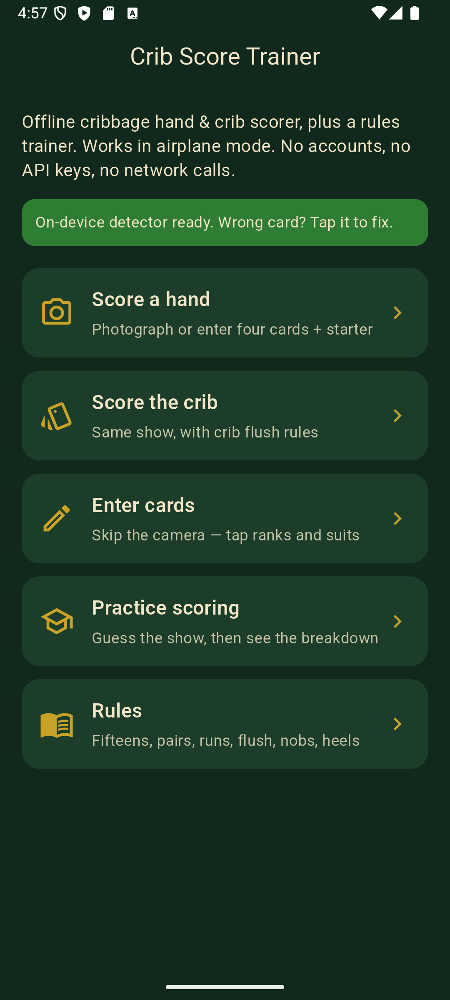

# Crib Score Trainer

Offline cribbage **hand** and **crib** scorer plus a rules trainer.

Photograph a show (or tap the cards in), confirm the four cards and the starter, and get a breakdown of fifteens, pairs, runs, flush, and nobs. Scoring is pure Dart on the device. Optional on-device TFLite detection never leaves the phone.

This repository is **source plus a sideload APK**. It is not an App Store or Play listing. Android testers can download the APK from [Releases](https://github.com/Brutieus/crib_score_trainer/releases). Developers can also `flutter run`. An iOS App Store build comes later.

Display name, Android label, and iOS `CFBundleDisplayName`: **Crib Score Trainer**. Dart package: `crib_score_trainer`. Do not rename it to “Cribbage Show”.

## Screenshots

Place PNG captures in [`docs/screenshots/`](docs/screenshots/) using these names (folder is empty until you run the app):

| Home | Capture | Review | Score | Trainer |
| --- | --- | --- | --- | --- |
|  |  |  |  |  |

## Requirements

- **Flutter 3.27.3** (stable) — this is the SDK used to create and test the project. Newer stable should work; if `pub get` complains, install 3.27.3 with `flutter version` / the [install archive](https://docs.flutter.dev/release/archive).
- Dart 3.6.1 (bundled with that Flutter).
- **Android:** Android Studio (or command-line SDK). An emulator or device with **API 26+** (Android 8.0). Camera + TFLite need that `minSdk`.
- **iOS:** Xcode 16+ on macOS, CocoaPods, a simulator or device. Camera/photo strings are already in `ios/Runner/Info.plist`.
- **Windows / desktop:** Visual Studio with the “Desktop development with C++” workload if you `flutter run -d windows`. Enable **Developer Mode** (Settings → System → For developers) so Flutter can create plugin symlinks. Photo detection uses the file picker; scoring and the trainer work without a camera.

No accounts. No API keys. There are none in this repo.

## Install on an Android phone

1. Open **[Releases](https://github.com/Brutieus/crib_score_trainer/releases)** on the phone (Chrome).
2. Download `CribScoreTrainer-arm64.apk` (the arm64 build; almost every current phone).
3. If Android blocks it, Settings → allow install from that browser, then open the APK.
4. First launch: grant **Camera** (and Photos if you pick from the gallery).

The APK is signed with the repo’s debug upload key so you can test. It is **not** a Play Store build. Uninstall any older Crib Score Trainer first if install fails.

iOS is in the source tree but is not shipped as an IPA yet.

## Clone and run

```bash
git clone https://github.com/Brutieus/crib_score_trainer.git
cd crib_score_trainer
flutter pub get
flutter run
```

Pick a device with `flutter devices` if more than one is attached (`flutter run -d windows`, `-d chrome` is **not** supported while `tflite_flutter` is a dependency).

Photo detection uses a bundled on-device YOLOv8n TFLite trained on a public 52-class playing-card dataset. Scoring and the trainer also work if you enter cards by hand.

## iOS permissions

`ios/Runner/Info.plist` includes:

- `NSCameraUsageDescription` — photograph a hand or crib for on-device card identification.
- `NSPhotoLibraryUsageDescription` — read a photo you pick of a hand or crib.

`ios/Podfile` enables `PERMISSION_CAMERA` and `PERMISSION_PHOTOS` for `permission_handler`. After a clone on macOS:

```bash
cd ios
pod install
cd ..
flutter run
```

## Android permissions

`android/app/src/main/AndroidManifest.xml` declares:

- `android.permission.CAMERA`
- `android.permission.READ_MEDIA_IMAGES` (Android 13+)
- `android.permission.READ_EXTERNAL_STORAGE` with `maxSdkVersion="32"`

`minSdk` is **26** so camera2 + TFLite/NNAPI are available.

The **release** manifest does **not** request `INTERNET`. Debug/profile builds add `INTERNET` only so Flutter hot reload can talk to the tool.

## Airplane mode / no-API guarantee

- Scoring, rules, and the trainer are local Dart. They work with the radio off.
- Detection, when a real model is present, runs with `tflite_flutter` on the device. No cloud vision, no LLM, no analytics.
- `pubspec.yaml` has no `http`, `dio`, Firebase, or model-host SDK. CI fails the `test/offline_policy_test.dart` check if those sneak in.
- There are **no API keys** to configure.

## Card model

| File | What it is |
| --- | --- |
| [`assets/models/README.md`](assets/models/README.md) | Runtime contract for `cards.tflite` + `class_names.txt` |
| [`assets/models/cards.tflite`](assets/models/cards.tflite) | Bundled YOLOv8n float32 detector (~12 MB), trained on a public 52-class playing-card set |
| [`assets/models/class_names.txt`](assets/models/class_names.txt) | 52 class codes (`10C`, `AH`, `KS`, …) in model index order |
| [`assets/models/train_and_export.md`](assets/models/train_and_export.md) | Retrain / re-export if you want a different deck |
| [`docs/TRAINING.md`](docs/TRAINING.md) | Public datasets (Roboflow, Kaggle CC0, geaxgx generator), YOLOv8n, TFLite |

Weights are **in the repo**. There is no secret download URL and no API key. The app never fetches a model at runtime (airplane mode still holds). If a future model exceeds GitHub’s comfort zone, switch that path to Git LFS and document `git lfs pull`.

## Tests

```bash
flutter test
```

Golden cribbage hands live in `test/scoring_test.dart` (29, 28, crib vs hand flush, Ace-low runs). `test/offline_policy_test.dart` guards against network packages.

```bash
dart format .
flutter analyze
```

## Known limits

- **Detection may need tap-to-fix.** Overlap, glare, odd decks, and the placeholder model will misread or skip cards. Always review the four slots and the starter before you trust the total.
- Scoring is exact **for the cards you confirm**. If the total is wrong, file a **wrong score** issue with the five cards. If the photo labeled the wrong rank, file **bad detection**.
- His heels (jack as starter) is pegged at the cut and is **not** in the default show total. Rules explain this.
- Pegging during the play is documented, not auto-scored from video.

## Contributing

1. Open a pull request against `main` with a clear scoring or detection test when you can.
2. Run `dart format .`, `flutter analyze`, and `flutter test`.
3. **No new network calls**, download URLs, or API keys.
4. Keep the product name **Crib Score Trainer**.

See [CONTRIBUTING.md](CONTRIBUTING.md). Use the **Wrong score** vs **Bad detection** issue templates.

## License

[MIT](LICENSE)
